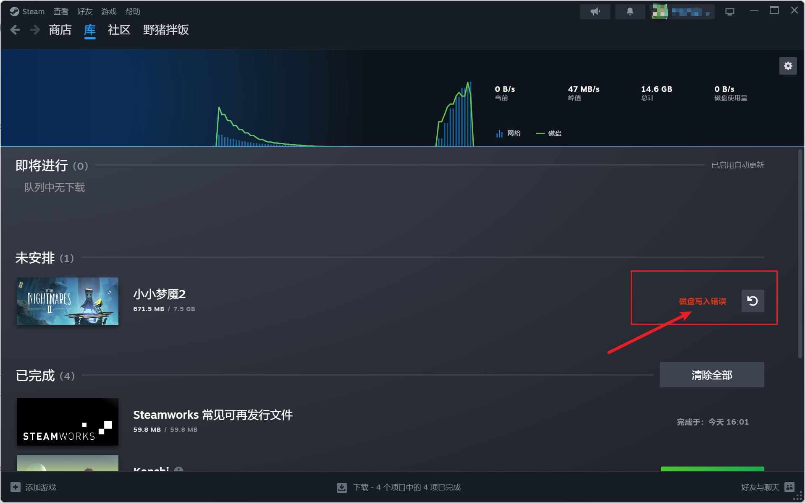
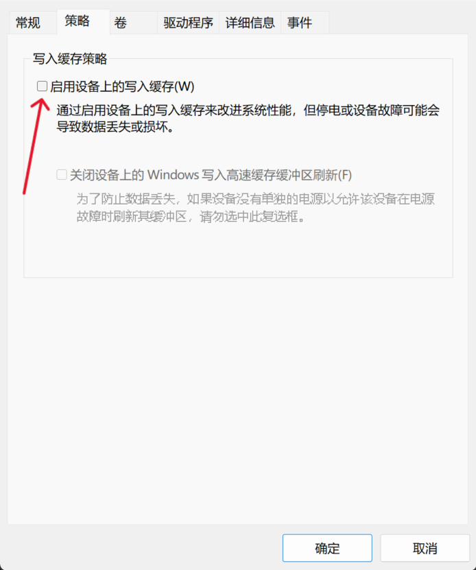

# steam磁盘写入错误

## 1.问题说明
steam在下载游戏时，会出现磁盘写入速度降低，甚至是降低到0MB/S的情况，这时就会出现磁盘写入错误的情况。
每个游戏都是这样，但是下载到其他盘时速度又是正常的。

## 2.解决方案
目前没有完美的解决方案，只有一个能大幅改善的办法，就是：**禁止windows写入缓存。**  
**设备管理器>选择有问题的硬盘>策略>取消勾选写入缓存**

虽然不能完全解决，但能大幅减低错误频率，甚至不出现错误，已经很满足了。  
## 吐槽
这个问题困扰了我很久，百度一大堆都是没什么用的答案，不仅是无效信息还答非所问，
导致我一直先下载到其他盘，再移动文件来解决问题，最怕的就是更新，要么重下要么忍受无限次的写入错误。
直到换个问法，翻了很久才有了解决的眉目。

